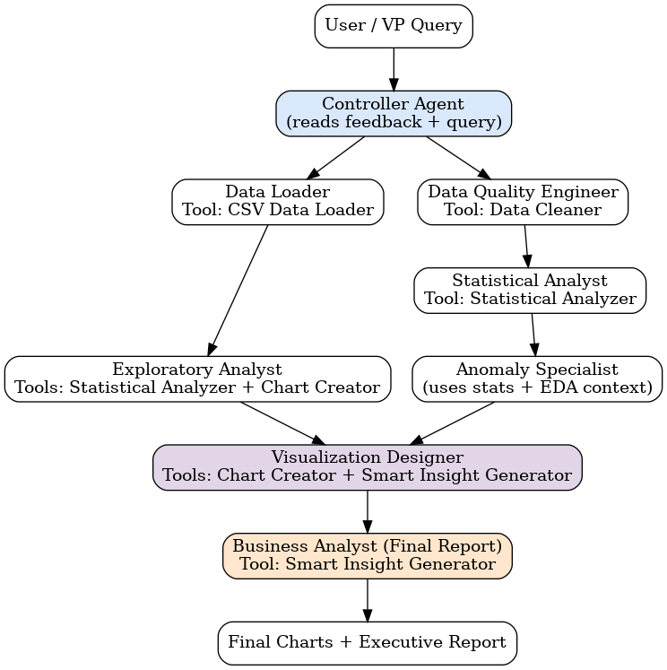

# Agentic Sales Analysis System 📊


Autonomous multi-agent AI system for Q3 2024 ecommerce sales analysis. Built with CrewAI, featuring 7 specialized agents, 4 built-in tools, 1 custom tool, and an innovative feedback loop that learns from past runs.

## 🎯 Key Features

- Automated data loading, cleaning, and analysis
- Statistical modeling with trend and correlation analysis
- Anomaly detection and interactive visualizations
- Executive-level insights with Q4 recommendations
- **Feedback loop learning** - adapts based on past runs
- Comprehensive evaluation framework with 4 test cases

## 🧠 Architecture



### Agents & Tools

**Agents**: Data Loader, Data Validator, Exploratory Analyst, Statistician, Anomaly Detector, Visualization Designer, Report Generator

**Built-in Tools**: CSV Data Loader, Data Cleaner, Statistical Analyzer, Chart Creator

**Custom Tool**: Smart Insight Generator (converts stats to business insights)

## ⚙️ Tech Stack

Python 3.10+ | CrewAI | Pandas | Plotly | SciPy | OpenRouter (Grok-4.1-fast)

## 🚀 Quick Start

### 1. Clone & Setup
```bash
git clone https://github.com/<your-username>/agentic-sales-analysis-system.git
cd agentic-sales-analysis-system
python -m venv venv
source venv/bin/activate  # Windows: venv\Scripts\activate
pip install -r requirements.txt
```

### 2. Configure Environment
Create `.env` file:
```ini
OPENROUTER_API_KEY=your_key_here
CREWAI_TRACING_ENABLED=false
```

### 3. Add Dataset
Place your data at: `data/ecommerce_q3_2024.csv`

Required columns: `date`, `revenue`, `category`, `marketing_spend`

### 4. Run
```bash
python main.py          # Run analysis
python evaluation.py    # Run tests
```

## 🧪 Test Cases

1. **Baseline** - Normal execution
2. **Missing Dataset** - File not found handling
3. **Missing Column** - Schema validation
4. **Large Dataset** - Scalability test (optional)

Results logged to: `outputs/eval/metrics.jsonl`

## 📁 Project Structure

```
project/
├── agents/              # 7 specialized agents
├── tools/               # 4 built-in + 1 custom tool
├── data/                # Input datasets
├── outputs/
│   ├── reports/         # Executive reports (TXT)
│   ├── visualizations/  # Charts (HTML)
│   └── eval/            # Metrics (JSONL)
├── main.py              # Main orchestration
├── evaluation.py        # Test suite
└── requirements.txt
```

## 🔧 Key Innovation

**Feedback Loop**: System reads past runs from `metrics.jsonl`, calculates success rates, identifies common errors, and feeds this context to the Controller Agent to adapt future workflows.

```python
def load_feedback_summary():
    # Analyzes last 5 runs
    # Identifies error patterns
    # Returns feedback to controller
    # Result: System improves over time
```

## 📊 Outputs

- **Executive Report**: Answers 5 business questions with recommendations
- **Visualizations**: Interactive Plotly charts (revenue trends, category analysis)
- **Metrics**: Success rates, runtime, error patterns

## 🐛 Troubleshooting

| Issue | Solution |
|-------|----------|
| API key error | Add `OPENROUTER_API_KEY` to `.env` |
| Dataset missing | Ensure `data/ecommerce_q3_2024.csv` exists |
| Module not found | Run `pip install -r requirements.txt` |

## 📄 License

MIT License - See LICENSE file for details
